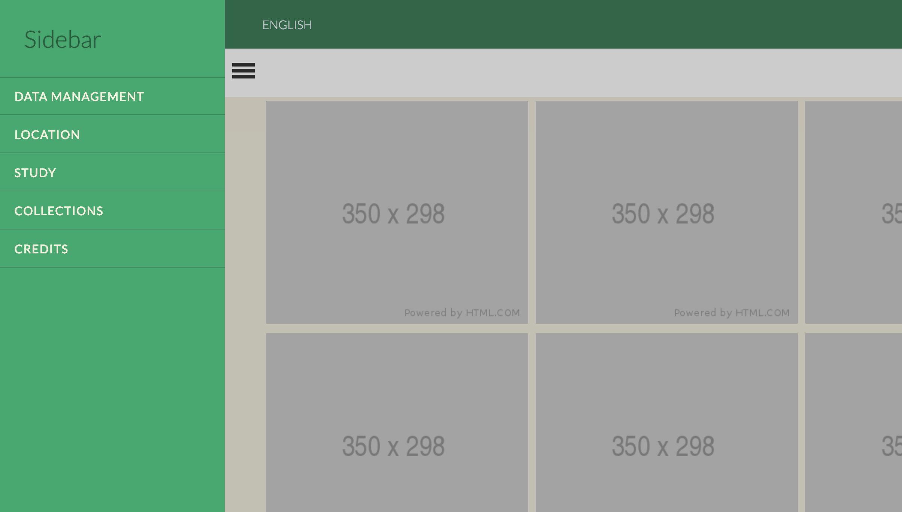

## Push over sliding menu with sticky top bar layout.

Content is just for demonstration purposes. 
Not a real grid or flex layout is implemented for the content.
Has a gulp setup.
Gulp Sass watcher with some plugins like autoprefixer.

originals folder is the css files before converted to sass. Can be deleted safely.

'Slide Along' is the name of the effect. 
Can be easily swapped just by copying html block for the nav and css rules belong that effect.

#### Original Files:
[Slide Along is the implemented one in the demo: ](https://tympanus.net/Development/SidebarTransitions/)
[Original github repo: ](https://github.com/codrops/SidebarTransitions)

Side menu closed: 

Side menu open: 

